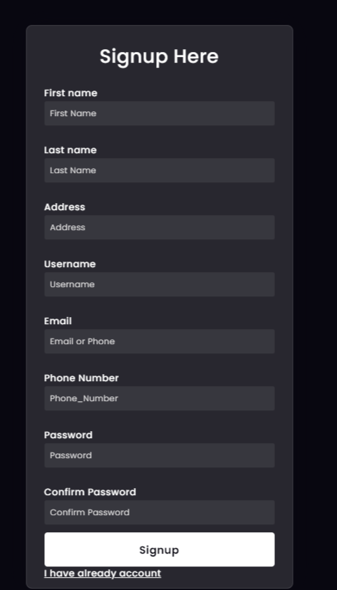
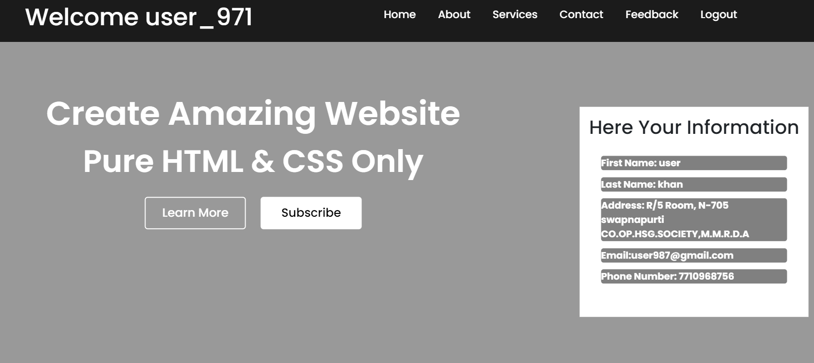

# Sign In / Sign Up Project using Django

## Install Django:

If you haven't already, install Django using pip:

```
pip install django
```

## Create a Django project:

Create a new Django project using the django-admin command:

```
django-admin startproject project_name
```

## Navigate to the project directory:

Move into the directory containing your Django project:

```
cd project_name
```

## Run the development server:

Start the Django development server using the manage.py script:

```
python manage.py runserver
```

This command will start the development server on your local machine, and you can access your Django project by visiting http://127.0.0.1:8000/ or http://localhost:8000/ in your web browser.

## Create a Django app (if needed):

Inside your project, you may want to create Django apps to organize your code. You can create a new app using the manage.py script:

```
python manage.py startapp app_name
```

## Configure settings (if needed):

You might need to configure your Django project's settings in the settings.py file. This includes database settings, static files configuration, installed apps, etc.

## Create database tables (if needed): 
If you've defined models in your Django app, you'll need to create database tables based on these models. Run the following command:
```
python manage.py migrate
```


## Video Link of project

https://youtu.be/qZNjK8F3JtA?si=rHTI9p5-5bTEzFfg

### Login Page


### Sign Up page



### User data display page


